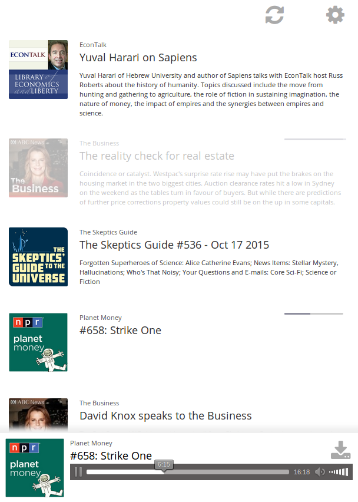

Web app to listen to podcasts.

Install
-------

The server is written in PHP so you will need compatible hosting.

It does not require a database, writing JSON to flat-text files instead.

From git:

	git clone https://github.com/chr15m/miniCast.git --branch build --single-branch miniCast

Or download a zip:

	https://github.com/chr15m/miniCast/releases/

The first time you visit the URL where you have uploaded the app, you will be prompted to create a new username and password.

You can set up podcasts by adding their RSS feed URL in the config.

The client is written in ClojureScript.

License
-------

[AGPLv3](./LICENSE.txt).
